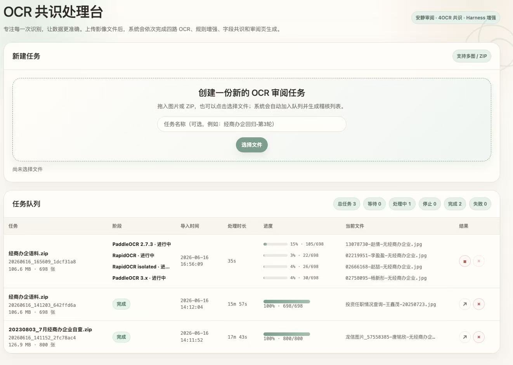
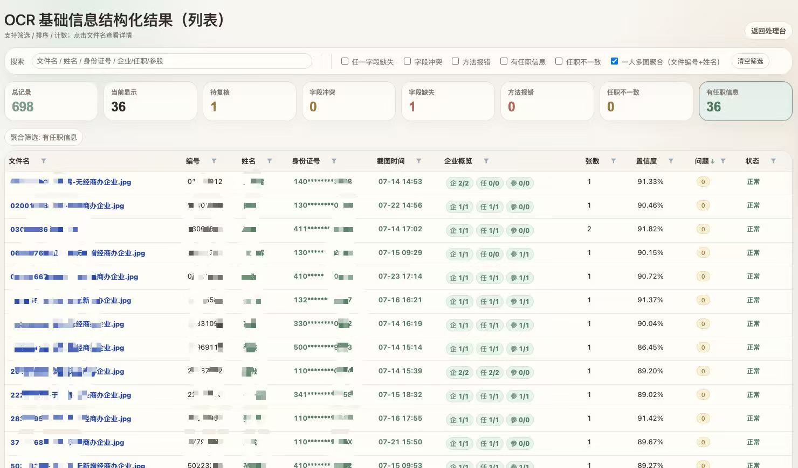
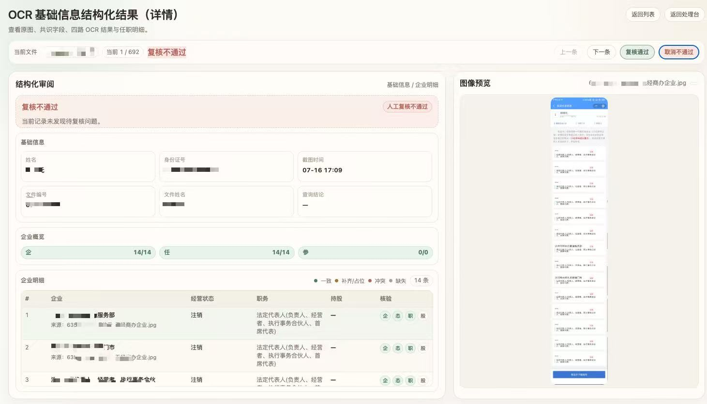
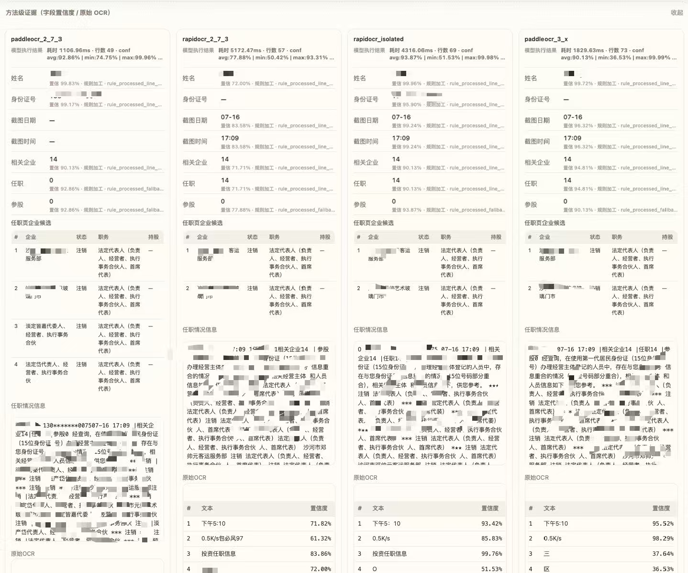

# OCR Consensus / OCR 共识处理台

[English](README.md) | [简体中文](README.zh-CN.md)

OCR Consensus 是一个多 OCR 引擎共识处理台，用于将截图、图片或压缩包中的图像批量解析为可审阅、可追溯、可对比的结构化结果。

它面向“仅有 OCR 原文还不够”的业务场景：系统会保留每个模型的识别证据，叠加规则增强与字段级共识，并提供列表页、详情页和方法级证据视图，帮助审阅人员定位问题、判断原因和沉淀质量基线。

## 项目价值

- **从 OCR 原文到结构化字段**：从非结构化 OCR 文本中抽取基础信息、时间、数量字段、企业明细、任职角色、经营状态、持股比例等字段。
- **多模型共识**：多路 OCR 独立执行，再通过字段级规则和共识策略合并结果。
- **可解释审阅**：最终字段不是黑盒结果，可查看来源模型、置信度、规则加工标记、冲突状态和原始 OCR 证据。
- **人工复核闭环**：支持人工通过/不通过、翻页审阅、聚合筛选、字段筛选和问题定位。
- **批量处理友好**：支持单图、多图和 ZIP 上传，任务队列串行调度，便于稳定跑批。

## 界面预览

以下截图已手工脱敏，仅用于展示产品流程和界面布局。

### 处理台

上传图片或 ZIP 包，创建处理任务，查看任务进度，并进入生成后的结果页。



### 结构化结果列表

通过聚合数字、搜索、排序、字段筛选和复核状态筛选，快速定位缺失、冲突、报错或任职信息异常的数据。



### 详情审阅页

在详情页集中查看共识结果、原始图片、基础字段、企业明细和人工复核操作。



### 模型证据对比

横向对比多路 OCR 的字段结果、原始 OCR 证据、置信度、规则加工标记和任职企业候选。



## 核心能力

| 能力 | 说明 |
| --- | --- |
| 多 OCR 引擎编排 | 多个 OCR 引擎独立执行，并保留每一路原始结果。 |
| 字段抽取与归一化 | 从噪声 OCR 文本中抽取结构化字段并清洗归一。 |
| 规则增强解析 | 针对脱敏证件号、截图时间、数量字段和页面噪声做确定性增强。 |
| 任职明细抽取 | 抽取企业名称、经营状态、承担职务、持股比例等明细字段。 |
| 字段级共识决策 | 合并多模型结果，同时保留缺失、冲突、占位和弱证据状态。 |
| 证据链保留 | 保留每个模型的字段结果、置信度、原始 OCR 文本和执行状态。 |
| 审阅看板 | 支持筛选、排序、聚合统计、图片预览、详情跳转和人工复核状态。 |
| 批量任务队列 | 支持图片和 ZIP 包进入受控任务队列处理。 |

## 工作流

1. **上传**：添加单张、多张图片，或上传 ZIP 包。
2. **OCR 多路执行**：按配置独立运行多个 OCR 引擎。
3. **Harness 增强**：执行文本清洗、字段抽取、归一化和候选过滤规则。
4. **共识决策**：将模型级字段合并为单一结构化结果，同时保留冲突和不确定性信号。
5. **人工审阅**：在列表页和详情页检查结果、对比证据，并标记复核通过或不通过。
6. **导出或迭代**：将结果用于下游处理、质量分析或规则迭代。

## 数据结构与审计信息

- 基础字段：文件编号、文件名、姓名、脱敏证件号、截图时间、相关数量字段。
- 任职明细：企业名称、经营状态、承担职务、持股比例等。
- 共识状态：一致、冲突、缺失、占位、证据补齐、规则加工等。
- 证据链：每个模型的字段结果、置信度、原始 OCR 文本和执行状态。
- 复核状态：待复核、复核通过、复核不通过及问题原因。

## 仓库结构

```text
.
├── app.py                         # 通用 Flask 入口
├── ops/
│   ├── consensus_task_app/         # 任务队列与审阅看板
│   ├── extract_basics.py           # 基础字段抽取
│   ├── extract_employment_info.py  # 任职明细抽取
│   └── *.py                        # 评估、导出、工具脚本
├── scenes/                         # 场景化抽取辅助逻辑
├── templates/                      # 简版模板
├── docs/assets/                    # README 图片资源
└── PUBLICATION.md                  # 发布与隐私检查清单
```

## 快速启动

```bash
python3 ops/consensus_task_app/app.py
```

启动后，在浏览器打开控制台打印的本地地址，上传测试图片或 ZIP 文件即可。

如需接入真实 OCR 引擎，建议通过环境变量配置模型、解释器和运行路径，避免在代码中硬编码本地环境。


## 当前状态

OCR Consensus 当前定位为“结构化抽取 + 多模型共识 + 人工审阅”的工作台，适合用于批量评估、规则迭代、质量分析和人机协同复核。

正式生产使用前，请确认 OCR 引擎部署、存储策略、访问控制、环境隔离和数据留存策略。
